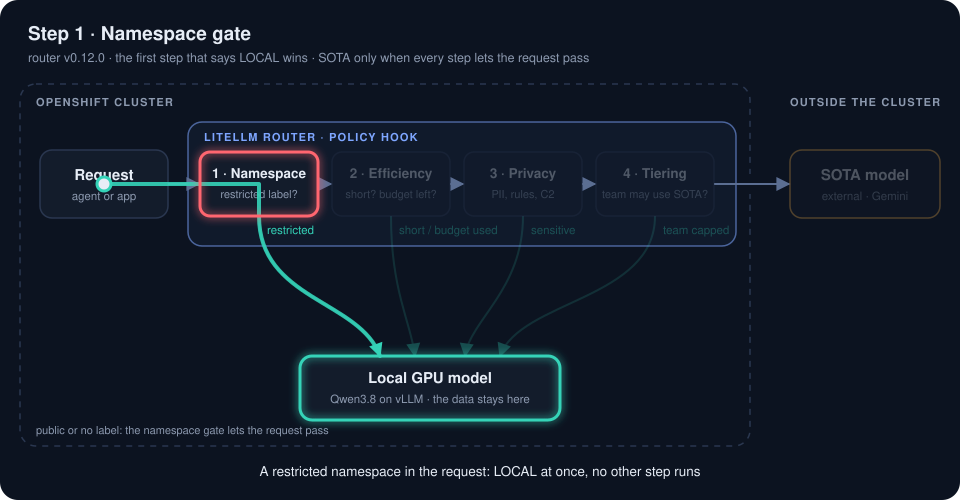
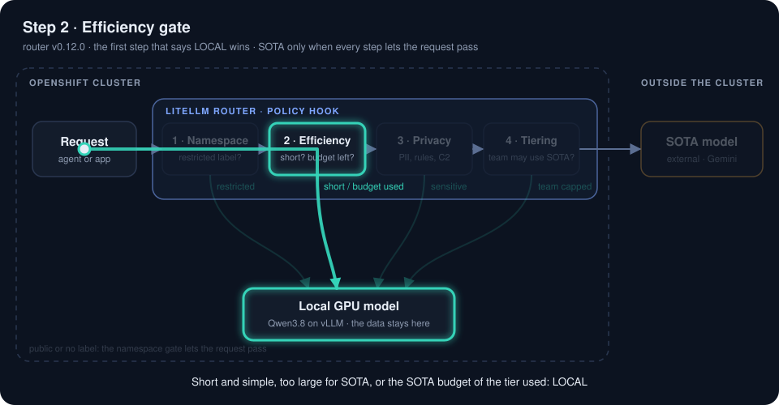
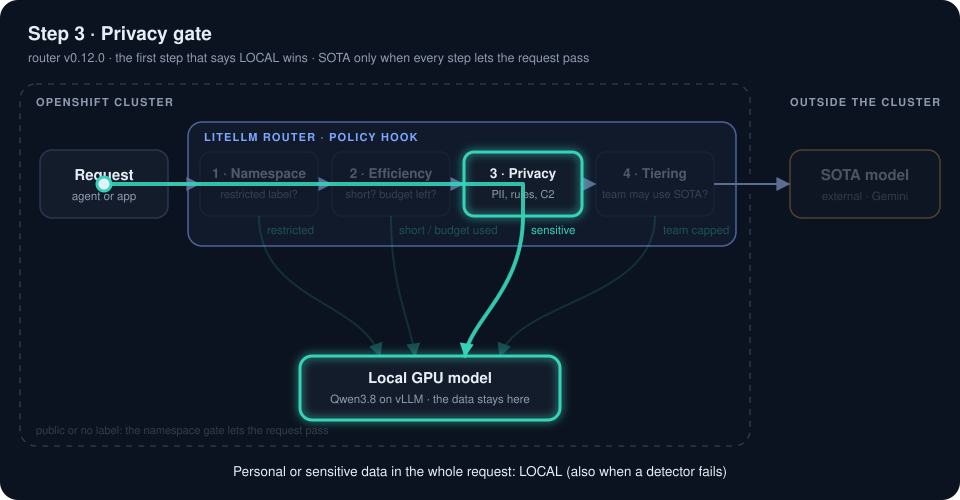
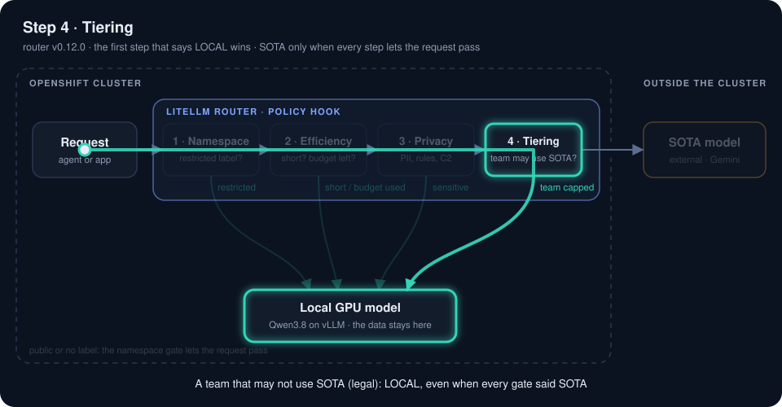
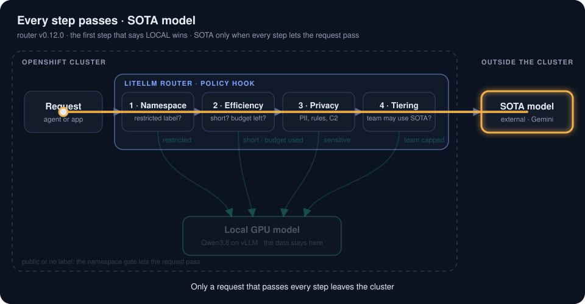

# router: LiteLLM hook code and image

Code of the smart router of the demo *The Sovereign, Self-Healing Platform*. For each request, a LiteLLM
hook decides whether the **local model** or the external **SOTA model** answers. Read
[`AGENTS.md`](AGENTS.md) before changing anything.

> **Support status:** LiteLLM is community software, operated by the customer, **not** supported by
> Red Hat. The privacy gate also calls Presidio (community, see the `presidio` repo). Routing between a
> local and an external model is Tech Preview in Red Hat OpenShift AI 3.5. The `systemone` backend of the
> C2 classifier (since v0.7.0) calls the example decision server of vLLM, which runs on an **unsupported
> preview image** (DiffusionGemma, vLLM structured-read mode). It is planned as Developer Preview in Red
> Hat AI Inference Server 3.6 GA and as Technology Preview in 3.7 EA1; its API may change.

This repo delivers two things with the **same version** (git tag `vX.Y.Z`):

| Item | Where it runs | How it reaches the cluster |
|---|---|---|
| Hook code: `litellm/policy_hook_chain.py`, `litellm/privacy_scoring.py`, `litellm/namespace_policy.py` (since v0.11.0) | LiteLLM pod, `/app/litellm` | The `gitops` repo copies the files at the tag into a ConfigMap (`scripts/sync-router-code.sh` there) |
| Image `quay.io/sovereign-selfheal/router:vX.Y.Z`: LiteLLM v1.102.0 + fastText + `lid.176.ftz` | LiteLLM pod | The `gitops` repo pins it by digest |

The policies (`chain.yaml`, `privacy-plus.yaml`) are **not** here: the `gitops` repo is their source of
truth. `tests/policy/` holds a copy for the tests and the evaluation.

## How the hook decides


The animation shows six example requests, one after the other. Its source is
`scripts/routing_chain_svg.py`: change it when the chain changes, then run
`python3 scripts/routing_chain_svg.py docs/img/routing-chain.svg` (it also writes the step images below).

### The steps, one by one

Every request passes the steps in this order. The first step that says LOCAL decides, and the steps
after it do not run. The values are those of the gitops policies (`chain.yaml`, `privacy-plus.yaml`).

#### 1. Namespace gate (since v0.11.0)



- **Checks** which namespaces the request is about: the router scans the text (PromQL matchers such as
  `namespace="payments"` or `=~"a|b"`, JSON and YAML `namespace` keys, `payments.svc`, `-n payments`,
  `/namespaces/payments`, also inside tool call arguments), and can read the list that an agent sends
  (`selfheal_namespaces`).
- **LOCAL** when one of them has the label `sovereign-selfheal.io/data-class=restricted`. No other step
  runs: no Presidio, no classifier, no budget read. `public`, no label or another value: next step.
- **Log:** `decided_by: namespace`, `namespace: restricted payments (found by scan) -> LOCAL`.
- **Keys:** `namespace_policy.*` in `chain.yaml`, env `NAMESPACE_SCAN_ENABLED` / `NAMESPACE_HINT_ENABLED`
  (off by default in the router; the gitops seed turns the scan on). See "Namespace policy".

#### 2. Efficiency gate



- **LOCAL** in three cases, checked in this order:
  1. the whole request is larger than the SOTA size cap (`sota_max_prompt_chars`, 150,000 characters):
     `efficiency: SOTA context limit (...)`, and no privacy detector runs (since v0.8.0);
  2. the tier of the API key used its SOTA budget in the window (`efficiency.sota_budget`, for example
     30k tokens in 5 minutes for `agents`): `efficiency: SOTA budget of tier agents used (...)` (since
     v0.12.0; the agent goes on with the local model, no 429);
  3. the question (last user turn) is short and simple: at most `max_prompt_chars_for_local` (280)
     characters and `simple_max_words` (40) words, and no `complex_keywords`:
     `efficiency: short/simple (...)`.
- Otherwise the next step: `efficiency: long/complex (...)`.
- **Log:** `decided_by: efficiency`; with a budget, also `sota_budget_used` and `sota_budget_limit`.

#### 3. Privacy gate



- **Checks the whole request**: every turn, the tool output and the tool call arguments, not only the
  last question. It adds the signals of: rules (regular expressions with validators, for example cards
  with the Luhn check, IBAN, Italian tax codes), lexicons (health, credentials, ...), Presidio NER (C1,
  can be off with `NER_ENABLED`) and the classifier (C2: the decision model with its yes/no questions,
  or a chat model).
- **LOCAL** when the score reaches the threshold of the team (`privacy-plus.yaml`: `legal` 0.30,
  `research` 0.70, others 0.50): `privacy: score 0.80 (health:0.80) >= 0.50[team=_default] -> LOCAL`.
- **Fail-closed:** when a detector fails, the request stays LOCAL.
- It is the last gate before the external model: no request reaches SOTA without this scan.

#### 4. Tiering



- **Runs after the gates** and can only move a decision to LOCAL. `tiering` in `chain.yaml` lists the
  models of each team: `legal` may use only `local-fast`.
- The team is the tier of the API key (header `x-team`, set by the gateway; a client cannot change it).
- **Log:** `decided_by: tiering`, `tiering: team 'legal' not allowed 'sota-smart' -> LOCAL`.

#### 5. Every step passes: the SOTA model



- **Log:** `decided_by: all-sota`; the reason is the one of the last gate (`privacy: score 0.00 ... -> SOTA`).
- When the SOTA call fails, LiteLLM answers with the local model (`fallbacks` in the gitops LiteLLM
  config): the answer stays in the cluster, and its tokens do not count in the SOTA budget.
- Any unexpected error in the hook sends the request LOCAL (`decided_by: fail-closed`).

`policy_hook_chain.py` runs two gates in order. The first gate that says LOCAL wins. Since v0.11.0 an
optional **namespace policy** runs before them (off by default; see "Namespace policy"): a request
about a restricted namespace stays local and no gate runs.

1. **Efficiency**: short and simple questions stay local; long questions, or questions with a
   complexity keyword, can go to SOTA. A request larger than the SOTA size cap stays local (since
   v0.8.0, off by default; see "Large requests").
2. **Privacy** (`privacy_scoring.py`): rules (regex with validators, lexicons), Presidio NER and an
   optional LLM classifier give a score. At or above the threshold of the team, the request stays local.

Then the **tiering** of the team can only move the decision to LOCAL. Any unexpected error routes LOCAL
(fail-closed). Every decision is logged as one line, `[policy-router] {...}`.

## Policy keys by version

The code reads its settings from the gitops policies (`chain.yaml`, `privacy-plus.yaml`) and from a few
env vars that the gitops repo sets on the LiteLLM pods. A new key always has a default that keeps the
previous behaviour, so an old policy works with a new release. Every release is listed, also the ones
without a new key.

| Since | Key (env override) | File | Default | Meaning |
|---|---|---|---|---|
| v0.3.0 | none | | | First release in this repo, the same code as the old images |
| v0.4.0 | `ner.person_min_words` | `privacy-plus.yaml` | `1` | A `PERSON` entity counts only with at least this many words. `2` ignores single words that Presidio reads as names ("Kafka", "Paxos", "Spiega"); a full name like "Mario Rossi" still counts |
| v0.4.0 | `ner.context_entities` | `privacy-plus.yaml` | `[]` | These entity types (for example `NRP`, `LOCATION`) count only when the text also has an identifier: structured personal data (card, IBAN, email, phone...) or another entity that counts. "European banks in Italy" names nobody |
| v0.5.0 | env `ROUTER_METRICS_PORT` | | `9091` | Port of the router metrics; no policy key (see "Traces and metrics") |
| v0.6.0 | `classifier.chat_template_kwargs` (`CLASSIFIER_CHAT_TEMPLATE_KWARGS`) | `privacy-plus.yaml` | none | Chat template arguments of the C2 call (see below) |
| v0.7.0 | `classifier.backend` (`CLASSIFIER_BACKEND`) | `privacy-plus.yaml` | `chat` | Backend of the C2 classifier: `chat` (one JSON verdict from a chat model, as before) or `systemone` (a decision server, see "C2 backends") |
| v0.7.0 | `classifier.decision_threshold` | `privacy-plus.yaml` | `0.5` | Backend `systemone`: a positive question at or above this probability adds the C2 signal |
| v0.7.0 | `classifier.samples` | `privacy-plus.yaml` | none | Backend `systemone`: noise draws per question; none = the default of the decision server (4) |
| v0.7.0 | `classifier.fallback_base_url_env` / `fallback_model_env` | `privacy-plus.yaml` | `CLASSIFIER_FALLBACK_BASE_URL` / `CLASSIFIER_FALLBACK_MODEL` | Backend `systemone`: env vars of the chat fallback |
| v0.8.0 | `efficiency.sota_max_prompt_chars` | `chain.yaml` | `0` (no cap) | SOTA size cap in characters of the whole request (see "Large requests") |
| v0.8.0 | `ner.timeout_per_1k_chars` / `classifier.timeout_per_1k_chars` | `privacy-plus.yaml` | `0` | Seconds of timeout per 1,000 characters of text, for Presidio and for each C2 call. `0` = the fixed `timeout_seconds`, as before. See "Large requests" |
| v0.8.0 | `ner.timeout_max_seconds` / `classifier.timeout_max_seconds` | `privacy-plus.yaml` | `timeout_seconds` | Upper bound of the timeout that grows with the text |
| v0.9.0 | `classifier.systemone.questions` | `privacy-plus.yaml` | the built-in questions | Backend `systemone`: the yes/no questions, `{id: {instructions: <text>, ignored: <bool>}}`. Positive questions add the C2 signal; `ignored: true` questions only show in the log. An invalid set (no positive question, an empty or missing `instructions`) is logged and the built-in questions are used. Keep the ids short: the answer template must fit the canvas of the decision server (64 tokens: about ten questions with one-token ids) |
| v0.9.0 | `classifier.systemone.show_all` | `privacy-plus.yaml` | `false` | Backend `systemone`: every positive question below the threshold also shows in the log with weight 0, for example `systemone/health@0.03(shown):0.00`. For evaluations |
| v0.10.0 | env `NER_ENABLED` (overrides `ner.enabled`) | | unset: the policy decides | C1 (Presidio NER) on or off (see below) |
| v0.11.0 | `namespace_policy.scan` / `.hint` (`NAMESPACE_SCAN_ENABLED` / `NAMESPACE_HINT_ENABLED`) | `chain.yaml` | `false` / `false` | The namespace policy: names found in the request text / sent by the agents (see "Namespace policy") |
| v0.11.0 | `namespace_policy.label` / `.hint_field` / `.refresh_s` | `chain.yaml` | `sovereign-selfheal.io/data-class` / `selfheal_namespaces` / `5` | Label key of the data class, body field of the hint, seconds between two reads of the labels |
| v0.11.1 | none | | | The scan also reads JSON tool call arguments, JSON argv arrays and every alternative of a regex matcher; the hint checks every name |
| v0.12.0 | `efficiency.sota_budget.tiers` / `.window_s` / `.redis_url` (`SOTA_BUDGET_TIERS` as JSON / `SOTA_BUDGET_WINDOW_S` / `SOTA_BUDGET_REDIS_URL`, and `SOTA_BUDGET_REDIS_PASSWORD`) | `chain.yaml` | `{}` (off) / `300` / `""` | SOTA token budget per tier, counters in Redis (see "SOTA budget per tier") |
| v0.12.0 | env `SOTA_ENABLED` | | unset: SOTA on | `0` in the local-only mode of gitops: nothing counts as SOTA |
| v0.12.1 | none | | | The tier of an answer comes from the `x-team` header (fix of the SOTA budget) |

The key `classifier.chat_template_kwargs` (since v0.6.0, default: none) is a mapping of chat template
arguments sent with the call of the C2 classifier. The env var `CLASSIFIER_CHAT_TEMPLATE_KWARGS` (a JSON
object) overrides it. The gitops repo sets `{"enable_thinking": false}` when the classifier is the local
Qwen3 model, which reasons by default: with reasoning, the classifier would spend its token budget and
return no JSON verdict. Do not set it for a provider that does not accept this parameter. An invalid
value (not a mapping, or an env var that is not a JSON object) is ignored with a `[policy-router]` log line.

The env var `NER_ENABLED` (since v0.10.0) overrides `ner.enabled` of the policy: `1`, `true`, `yes` or
`on` turn C1 (Presidio NER) on, any other value turns it off. Unset or empty, the policy decides. With
C1 off, Presidio gets no calls and the log has no `ner` signals; the log line still shows
`ner_timeout_s`. The gitops repo turns C1 off when the decision model answers C2 (see its README).
Quality and gate time with C1 on and off: [`docs/c1-off-eval-2026-10-05.md`](docs/c1-off-eval-2026-10-05.md).

Ignored entities stay in the log with weight 0, for example `NRP@0.85(no id):0.00` or
`PERSON@0.85(<2 words):0.00`, so the log shows what the engine saw and why it did not count it.

## SOTA budget per tier (since v0.12.0)

Each **tier** can have a budget of SOTA tokens per time window. The tier is the `x-team` header that
the gateway sets from the API key (label `maas-group`; a client cannot change it). With one agent per
application and one key per agent, a tier is an application: a business-critical application gets a
larger budget. When the SOTA tokens of a tier in the last window reach its budget, the efficiency gate
keeps the request **LOCAL**: the agent goes on with the local model. The gateway tiers (Kuadrant
`TokenRateLimitPolicy` in the gitops repo) still count all the tokens and answer 429 above their limit:
they stay the ceiling.

```yaml
efficiency:
  sota_budget:
    window_s: 300
    tiers: {agents: 150000, agents-critical: 600000}   # SOTA tokens per window; no entry = no limit
    redis_url: redis://litellm-redis:6379/0
```

| Env var | Overrides |
|---|---|
| `SOTA_BUDGET_TIERS` | `tiers`, as a JSON object (`{"agents": 150000}`) |
| `SOTA_BUDGET_WINDOW_S` | `window_s` |
| `SOTA_BUDGET_REDIS_URL`, `SOTA_BUDGET_REDIS_PASSWORD` | `redis_url`; the password only comes from the env |
| `SOTA_ENABLED` | `0` in the local-only mode of gitops: `sota-smart` is then the local model, and nothing counts |

- **Counters in Redis**, shared by the LiteLLM pods (`litellm/sota_budget.py`). The window slides: one
  key per fixed window with a TTL of two windows; the tokens used are the current window plus the share
  of the previous one that still falls in the last `window_s` seconds. A Redis restart starts the
  counters from zero.
- **Only SOTA answers count**: the model group of the deployment that answered must be `sota-smart`. A
  fallback to the local model after a SOTA error does not count, and neither does the local-only mode.
- The budget is read **once per request, before the gates**, and the answer is counted when it arrives:
  parallel requests can go a little over the budget.
- **Fail-open**: when Redis cannot be reached, the budget does not apply (normal routing), with a log
  line and `router_sota_budget_store_errors_total`. The budget controls cost, not privacy: the gates
  still run. This is the one exception to fail-closed in this repo (decided on 2026-10-06).
- A restricted namespace keeps the request local before the budget is read (no store call).
- Log line, only for a tier with a budget: `sota_budget_used`, `sota_budget_limit`, and
  `sota_budget_error` after a store error. Reason when the budget is used:
  `efficiency: SOTA budget of tier agents used (151200/150000 tokens in 5m) -> LOCAL`.
- The old key `efficiency.sota_token_budget` (one counter per pod, no window) still works and stays off.

## Namespace policy (since v0.11.0)

The same agent can investigate a sensitive application and an ordinary one. A platform team marks the
namespace of a sensitive application with a label, and every request about that namespace stays on the
local model:

```bash
oc label namespace payments sovereign-selfheal.io/data-class=restricted --overwrite
```

**Only `restricted` changes the routing.** A request about a restricted namespace goes to `local-fast`
before the gates (`decided_by: namespace`): no detector runs, so the decision is also faster. No label,
`public` or any other value keeps the normal routing (efficiency and privacy gates). `public` only says
that someone classified the namespace. An unknown value, for example a typo, keeps the normal routing
and shows in the metric `router_namespace_labels{state="unknown"}`.

**How the router knows the namespaces of a request.** Two ways, each with its own switch. One
restricted namespace from either way is enough.

| Switch | Way | Notes |
|---|---|---|
| `hint` | The agent sends the names in the request body: `"selfheal_namespaces": ["payments"]` | Precise. Contract for agents: [`docs/namespace-policy.md`](docs/namespace-policy.md) |
| `scan` | The router finds names in the text of the request: PromQL label matchers (`namespace="payments"`, every alternative of `namespace=~"a\|b"`, wildcards like `"pay.*"` against the labelled names), JSON and YAML `namespace` keys, the alert labels of ogx-alert-translator (``- `namespace`: payments``), `payments.svc`, `-n payments` (also in a JSON argv array), `/namespaces/payments`; also inside JSON-encoded tool call arguments (v0.11.1) | Needs no change in the agent. A name that never appears in the text is not seen. It also catches a tool that reads a restricted namespace during an investigation of another one. About 8 ms for 400,000 characters (v0.11.0; the v0.11.1 forms add a few ms) |

The hint field is removed from **every** request, also when the switch is off, so LiteLLM never sends
it to a model.

**Labels.** The router lists the namespaces that have the label key, with the ServiceAccount of the pod
(`get`/`list`/`watch` on namespaces, given by the gitops repo). The first read happens when the hook
loads, then a thread reads again every `refresh_s` seconds. A failed read keeps the last list. When the
list was never read, nothing counts as restricted: the normal routing applies, the log line shows
`ns_labels_loaded: False` and `router_namespace_labels_loaded` is 0.

| Key (in `chain.yaml`, block `namespace_policy`) | Default | Meaning |
|---|---|---|
| `scan` | `false` | Find namespace names in the request text. Env override: `NAMESPACE_SCAN_ENABLED` |
| `hint` | `false` | Read the names that the agent sends. Env override: `NAMESPACE_HINT_ENABLED` |
| `label` | `sovereign-selfheal.io/data-class` | Label key on the namespaces |
| `hint_field` | `selfheal_namespaces` | Field of the request body with the names |
| `refresh_s` | `5` | Seconds between two reads of the labels (minimum 1) |

The env overrides accept `1`, `true`, `yes` or `on` (on) and any other value (off); unset or empty, the
policy decides. With both switches off the hook makes no Kubernetes API call and starts no thread.

With the policy on, the log line has four more keys: `ns_restricted` (the restricted names found),
`ns_source` (`hint`, `scan`, `hint+scan` or `none`), `namespaces` (the hint names and the labelled names
that the scan found) and `ns_labels_loaded`. The trace has one more span, `gate.namespace` (verdict
`local` or `pass`).

## Large requests (since v0.8.0)

The self-heal agents send the whole conversation each turn: system prompt, tool definitions, tool calls
and their output. These requests can be larger than the SOTA model accepts, and Presidio and C2 need more
time for them. Measurements: [`docs/c2-large-context-2026-10-01.md`](docs/c2-large-context-2026-10-01.md).
The values below, and the tests behind them: [`docs/sota-size-cap-2026-10-01.md`](docs/sota-size-cap-2026-10-01.md).
Both features are off by default.

**SOTA size cap** (`efficiency.sota_max_prompt_chars` in `chain.yaml`). The efficiency gate measures the
whole request in characters: every message, the tool call arguments and the tool definitions. Above the
cap the request stays LOCAL with the reason `efficiency: SOTA context limit (<size> > <cap> chars)`, and
no detector runs (no Presidio call, no C2 call). An error while measuring also routes LOCAL. The cap is
in characters, not in tokens: the router has no tokenizer, and the SOTA model would count with its own.
Choose it as the smaller of two limits: `(SOTA context window - max_tokens of the agents - margin) x
characters per token`, and the largest text that Presidio and C2 read within their timeouts. Log text
has about 2.3 characters per token for Qwen and about 1.6 for Gemini, English prose about 4. With a
65,536-token window the first limit gave 117,000 characters
([2026-10-01](docs/sota-size-cap-2026-10-01.md)). With gemini-2.5-pro the detectors set the limit:
150,000 characters ([2026-10-02](docs/sota-size-cap-2026-10-02.md)).

**Timeouts that grow with the text** (`ner.*` and `classifier.*` in `privacy-plus.yaml`). The timeout of
one call is

```
min(max(timeout_seconds, timeout_per_1k_chars x characters / 1000), max(timeout_seconds, timeout_max_seconds))
```

where the characters are those of the text sent to the detector. With `timeout_per_1k_chars: 0` the
timeout is `timeout_seconds`, as before. A timeout still fails closed. Values from the measurements of
2026-10-01, with a margin of about 1.4-1.5x: Presidio `0.052` s per 1,000 characters, max `10`;
C2 `0.11`, max `15`. The bound is per call: Presidio is called twice (`en` and `it`) when the language
is uncertain, and C2 with `systemone` calls the chat fallback after a failure. The worst case of the
gate with these values is 2 x 10 + 2 x 15 = 50 s.

**Log line.** The decision has four more keys (additive, the previous keys do not change):
`prompt_chars` (size of the whole request, `None` if it could not be measured), `sota_cap` (`None` =
off), and, when the privacy gate ran, `ner_timeout_s` and `c2_timeout_s` (the effective timeouts).

## C2 backends (since v0.7.0)

The C2 classifier runs only in the gray zone of the privacy score, and it can only add a signal.

| Backend | Call | Signal when sensitive |
|---|---|---|
| `chat` (default) | `POST $CLASSIFIER_BASE_URL/chat/completions`: one JSON verdict `{"sensitive", "confidence"}` | `llm@0.90` |
| `systemone` | `POST $CLASSIFIER_BASE_URL/systemone` (the example decision server of vLLM): yes/no questions with the text as state, one probability each from one forward pass | `systemone/llm@0.93(legal)` |

The built-in `systemone` questions keep the criteria of the chat prompt: `personal_sensitive` and
`credentials` add the signal (weight 0.80, as the chat backend) when the higher of the two is at or above
`classifier.decision_threshold`. Since v0.9.0 the policy can replace them
(`classifier.systemone.questions`), and the label names the positive question with the highest
probability: `systemone/llm@0.93(legal)`. The label still contains `llm@<p>`, as before. See
[`docs/c2-questions-eval-2026-10-03.md`](docs/c2-questions-eval-2026-10-03.md) for an evaluation of
split questions. `business_confidential` never adds weight; it stays in the log with
weight 0, for example `systemone/business_confidential@0.99(ignored):0.00`, so the log shows why a
confidential business text may still go to SOTA.

**Fallback chain.** With `systemone`, an error, a timeout (`timeout_seconds`, 8 s by default) or a reply
without a probability for every question does not fail closed at once. The hook asks the chat backend at
`CLASSIFIER_FALLBACK_BASE_URL` / `CLASSIFIER_FALLBACK_MODEL` (the local Qwen model in the demo) with the
chat prompt; its signal is `fallback/llm@0.90`. Only when the fallback fails too, or is not set, the
signal is `error` (fail-closed). The worst case is two timeouts, 16 s. The span `gate.privacy` gets the
attributes `classifier.backend` and `classifier.fallback` (boolean). The fallback matters in the demo:
with `grayLow: "0"`, a fail-closed C2 would send every request LOCAL.

The evaluation of both backends (quality and latency) is in
[`docs/c2-backends-eval-2026-09-30.md`](docs/c2-backends-eval-2026-09-30.md). Parallel calls, prompt
size and C2 while the local model is busy are in
[`docs/c2-backends-performance-2026-10-01.md`](docs/c2-backends-performance-2026-10-01.md); the test
script is [`perf/c2_perf.py`](perf/c2_perf.py). The privacy gate and C2 with agents' large contexts (8,000 to 255,000
tokens) are in [`docs/c2-large-context-2026-10-01.md`](docs/c2-large-context-2026-10-01.md). The vLLM prefix cache of the
local Qwen model (before and after it was turned on) is in
[`docs/qwen-prefix-cache-2026-10-02.md`](docs/qwen-prefix-cache-2026-10-02.md).

Measured on 2026-09-30 on one NVIDIA L40S (the decision server with three questions, a new text each
call): about 350 ms for a short prompt (134 ms with `samples: 1`), 570 ms for 3,800 tokens, 5.8 s for
40,000 tokens. The first call after the model starts takes about 30 s.

## Traces and metrics (since v0.5.0)

The hook shows each decision as a trace and as metrics. **Instrumentation is never on the decision
path**: every tracing or metrics error is logged (`[policy-router] tracing error (ignored)`) and
ignored, and the decision is the same with or without OpenTelemetry and `prometheus_client`. Both
packages are in the LiteLLM image (opentelemetry 1.28.0, prometheus_client 0.20.0, extra
`proxy-runtime` of LiteLLM 1.102.0); without them the hook works as before.

**Traces.** With the `otel` callback of LiteLLM on, LiteLLM creates one span per proxy request and
passes it to the hook (`metadata.litellm_parent_otel_span`). The hook adds:

```
<proxy request span>                      (LiteLLM)
├── router.chain                          route.requested, route.target, route.decided_by,
│   │                                     route.team, route.reason
│   ├── gate.namespace                    gate.verdict (local|pass), gate.reason (v0.11.0, policy on)
│   ├── gate.efficiency                   gate.verdict, gate.reason
│   └── gate.privacy                      gate.verdict, gate.reason, privacy.score,
│       │                                 privacy.threshold, privacy.team_key, privacy.signals
│       └── presidio.analyze (per lang)   presidio.language, presidio.entities_found
└── litellm_request                       (LiteLLM, with USE_OTEL_LITELLM_REQUEST_SPAN=true):
                                          the model call; hidden_params has the api_base
```

A gate that is not evaluated (short-circuit) has no span. An error (for example Presidio down) is
recorded on its span. Without a parent span, `router.chain` is a root span; without the `otel` callback
the spans are no-ops. The decision gets one more key, `trace_id` (32 hex characters), only when a
trace exists: the log line keeps all its previous keys.

**Metrics.** The hook serves the default `prometheus_client` registry on `ROUTER_METRICS_PORT`:
its own metrics, and the ones of LiteLLM's `prometheus` callback when that is on.

| Metric | Type | Labels | Meaning |
|---|---|---|---|
| `router_requests_total` | counter | `routed_to`, `decided_by`, `team` | One per decision. `decided_by`: `namespace` (v0.11.0), `efficiency`, `privacy`, `tiering`, `all-sota`, `fail-closed`. `team` is a team named in the policies, `none` or `other` |
| `router_privacy_score` | histogram | `team` (threshold key) | Privacy score of the requests that reached the privacy gate |
| `router_sota_budget_used_tokens` | gauge | | SOTA tokens counted by the old per-pod budget (`sota_token_budget`) |
| `router_sota_tokens_total` | counter | `team` | v0.12.0: tokens of the answers of the SOTA model, per tier (fallbacks and local-only mode excluded) |
| `router_sota_budget_window_tokens` | gauge | `team` | v0.12.0: SOTA tokens of the tier in the last window, read from Redis at the last check of this pod |
| `router_sota_budget_limit_tokens` | gauge | `team` | v0.12.0: budget of the tier per window |
| `router_sota_budget_store_errors_total` | counter | `op` (`read`, `write`) | v0.12.0: Redis errors; the budget did not apply (fail-open) |
| `router_namespace_decisions_total` | counter | `target_namespace`, `routed_to`, `source` | v0.11.0, namespace policy on: one per decision and restricted namespace. `target_namespace` is a restricted namespace or `none` (a bounded set: the platform team sets the labels; not `namespace`, which Prometheus sets to the scrape namespace) |
| `router_namespace_labels_loaded` | gauge | | v0.11.0: 1 when this pod read the namespace labels at least once |
| `router_namespace_labels` | gauge | `state` | v0.11.0: labelled namespaces, `restricted`, `public` or `unknown` (another value) |

Tokens and fallbacks per model come from LiteLLM's `prometheus` callback
(`litellm_total_tokens_metric_total{requested_model=...}`,
`litellm_deployment_successful_fallbacks_total{requested_model="sota-smart",fallback_model="local-fast"}`).

| Env var | Read by | Default | Meaning |
|---|---|---|---|
| `ROUTER_METRICS_PORT` | hook | `9091` | Port of the metrics server; `0` = off. Started once per process; a bind error is logged and the router works without metrics. Off when `PROMETHEUS_MULTIPROC_DIR` is set |
| `OTEL_EXPORTER`, `OTEL_ENDPOINT`, `OTEL_SERVICE_NAME` | LiteLLM `otel` callback | | Where the traces go (the gitops repo sets the in-cluster collector) |
| `USE_OTEL_LITELLM_REQUEST_SPAN` | LiteLLM | `false` | `true`: a child span for the model call |

## Develop and test

The Python tools are managed with [uv](https://docs.astral.sh/uv/), never pip.

```bash
uv sync                              # creates .venv from uv.lock
uv run pytest                        # unit tests: no network, no LiteLLM, no Presidio
uv run ruff check .
```

The unit tests use a fake Presidio and a fake LiteLLM module (`tests/conftest.py`).

## Evaluation

`eval/` has three sets of labelled prompts (all personal data is synthetic): `privacy-plus-english.yaml`,
`privacy-plus-italian.yaml` (332 cases each) and `chain-demo.yaml` (126 cases, gate order).
`eval/run_eval.py` scores them with the real engine. `eval/check_baseline.py` runs every set and fails on
a **new leak**: a case that must stay LOCAL, goes to SOTA, and is not in `eval/baseline.json`.

The sets contain cases that fail on purpose (for example the `implicit` ones, which need the LLM
classifier). The baseline records them, so only a change for the worse fails.

```bash
scripts/fetch-lid-model.sh           # fastText model into .cache/, sha256 checked
podman run -d --rm -p 3000:3000 quay.io/sovereign-selfheal/presidio:<version>
uv run eval/check_baseline.py        # compare with eval/baseline.json
uv run eval/check_baseline.py --update   # accept the new results (explain why in the PR)
```

The classifier stays off in the evaluation, and the harness uses the default threshold of the policy.
To compare the C2 backends, run `eval/run_eval.py` against a cluster (port-forward Presidio and the
classifier) with `CLASSIFIER_ENABLED=1 CLASSIFIER_GRAY_LOW=0`, then `CLASSIFIER_BACKEND=chat` or
`systemone` and the `CLASSIFIER_*` URLs; `CLASSIFIER_SAMPLES` sets `classifier.samples`. A row counts as
`classifier_fired` when a classifier signal has weight above 0.

## Release

Quay builds the image. A build trigger on the Quay repository follows the git tags of this repo:

1. Merge the change on `main`. The CI must be green.
2. Create and push a tag `vX.Y.Z` (`git tag v0.4.0 && git push origin v0.4.0`).
3. Quay builds `Containerfile` and publishes `quay.io/sovereign-selfheal/router:vX.Y.Z`.
4. In the `gitops` repo, run `scripts/sync-router-code.sh sync vX.Y.Z`. It copies the hook code at the
   tag and sets `routerVersion`. Then pin the image digest of the same tag in
   `components/litellm-router/values.yaml` and open a PR.

Never move or reuse a tag. To read the digest of a tag:

```bash
curl -fsS "https://quay.io/api/v1/repository/sovereign-selfheal/router/tag/?specificTag=vX.Y.Z" \
  | python3 -c 'import json, sys; print(json.load(sys.stdin)["tags"][0]["manifest_digest"])'
```

Quay setup (once): public repository `sovereign-selfheal/router`, build trigger on the GitHub repo
`sovereign-selfheal/router`, only for refs that match `tags/v.*`, Dockerfile `/Containerfile`, context
`/`, image tag = git tag name (`${parsed_ref.tag}`), no `latest`.

## Check your changes (also run by CI)

```bash
uv sync --locked
uv run ruff check .
uv run yamllint .
shellcheck scripts/*.sh
hadolint Containerfile
uv run pytest
uv run eval/check_baseline.py        # needs Presidio on localhost:3000, see "Evaluation"
podman build -f Containerfile -t localhost/router:dev .
```

## License

Apache License 2.0, see [LICENSE](LICENSE). The hook code and the evaluation sets come from the old
repository `rhocpai-mvp-routing` (BSD 3-Clause, same author).
