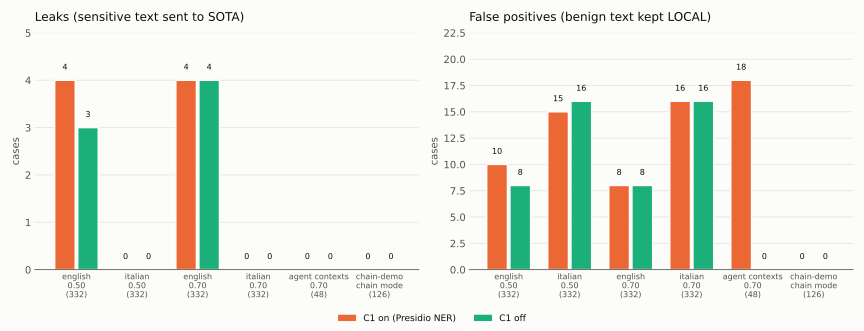
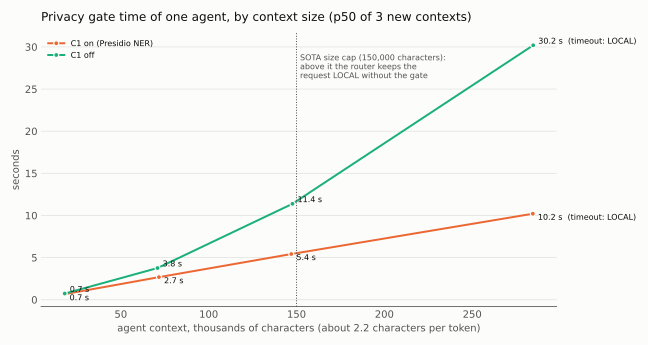
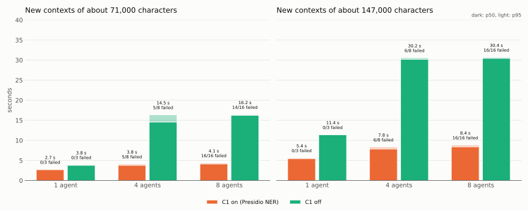
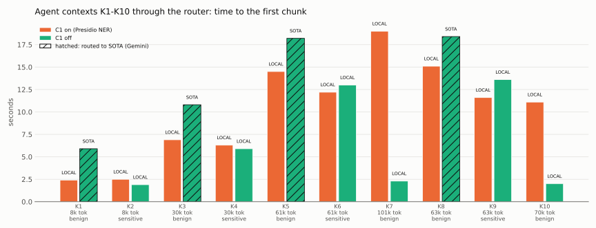

# C1 off with the decision model: quality and performance, 2026-10-05

Since router v0.10.0 (`NER_ENABLED`) and gitops PR #32, the privacy gate runs without the Presidio NER (C1)
when the decision model answers C2. This page compares the gate with C1 on and with C1 off, with the
code and the policy of today: routing quality on the evaluation sets, the time of the gate, and the
agent contexts of the validation through the router.

> **Support status:** LiteLLM and Presidio are community software, not supported by Red Hat. The
> decision model (`systemone`) runs on an unsupported preview image.

## Results in short

- **Quality: no new leak in any set.** On the agent contexts the false positives go from 18 to 0: C2
  alone keeps the 28 sensitive contexts LOCAL. On the generic sets, at the threshold of the agents
  (0.70) no decision changes; at 0.50 the differences are small, and only two come from Presidio.
- **One agent: the gate is faster with C1 on, but for a wrong reason.** On agent logs Presidio always
  finds entities (false positives), the score passes the threshold, and the gate ends before C2: the
  context stays LOCAL even when it is benign. With C1 off, C2 reads every context: 3.8 s instead of
  2.7 s at 71,000 characters, 11.4 s instead of 5.4 s at 147,000.
- **Many agents with new large contexts: both setups saturate and fail closed (LOCAL).** With C1 on,
  Presidio times out and the calls stay LOCAL after about 4 s. With C1 off, the calls wait for the C2
  timeout and the chat fallback (about 15 s at 71,000 characters, 30 s at 147,000); a few benign
  contexts still reach SOTA.
- **Through the router:** the benign agent contexts now go to SOTA (Gemini), with a later first chunk
  than on the local model (5.9-18.4 s against 2.4-15.1 s).
- **Open question:** some C2 answers differ between two runs for the same text. It is not caused by C1
  (see the last section).

## Setup

- Cluster ocp.rw287 (OCP 4.22.15, RHOAI 3.5.1), router v0.10.0, gitops `main` 6aeb668: the nine
  `systemone` questions with `money` v1.1, `samples: 1`, `--max-num-seqs=16`. DiffusionGemma 26B-A4B FP8
  on one NVIDIA L40S (g6e.2xlarge), prefix cache on. Presidio with English and Italian NER, 2 replicas.
- Everything ran **inside one LiteLLM pod**, with the policy of the pod (`/app/litellm/privacy-plus.yaml`)
  and its C2 settings (`CLASSIFIER_BACKEND=systemone`). Only the environment changed:
  **C1 on = `NER_ENABLED=1`**, **C1 off = `NER_ENABLED=0`**. Same pod, same models, same hour.
- Quality: `eval/run_eval.py` with `CLASSIFIER_ENABLED=1 CLASSIFIER_GRAY_LOW=0` (C2 runs on every prompt
  below the threshold, as in the demo), as on 2026-10-03. Sets: `privacy-plus-english` and
  `privacy-plus-italian` (332 cases each) at 0.50 and at 0.70 (the `research` tier of the agents),
  `agent-contexts` (48: 20 benign, 28 with one sensitive sentence) at 0.70, `chain-demo` (126) in chain
  mode.
- Time of the gate: the new `gate` scenario of `perf/c2_perf.py`. It calls `PrivacyScorer.score()` with
  the policy of the pod, as the router does: the rules, then Presidio when C1 is on, then C2 in the
  gray zone. Every call has a new agent context (log-like text, so no cache can help), half of them
  with a sensitive sentence; threshold 0.70. One agent: 3 contexts per size. Parallel agents: 2 rounds
  per level. The quality runs above cannot give a fair time: the second configuration reads texts
  that the decision server has already seen.

## Quality

| Set (threshold) | C1 on: leaks / FP | C1 off: leaks / FP |
|---|---|---|
| english (0.50) | 4 / 10 | **3 / 8** |
| italian (0.50) | 0 / 15 | 0 / 16 |
| english (0.70) | 4 / 8 | 4 / 8 |
| italian (0.70) | 0 / 16 | 0 / 16 |
| **agent contexts (0.70)** | 0 / **18** | **0 / 0** |
| chain-demo (chain mode) | 0 / 0 | 0 / 0 |

- **Agent contexts.** With C1 on, Presidio found entities in all 48 contexts (`PERSON`, `LOCATION`,
  `MEDICAL_LICENSE`, `IP_ADDRESS` in logs and tickets). In 45 of them the score was already 0.73-0.94,
  over the threshold, so C2 ran on only 3 contexts, and 18 of the 20 benign ones stayed LOCAL. With C1
  off, C2 read all 48 contexts and its questions caught the 28 sensitive sentences.
- **Generic sets at 0.70:** the same decision for every case.
- **Generic sets at 0.50:** 7 English and 3 Italian decisions differ. Two come from Presidio: two false
  positives that go away (`pii-weak-02`, a phone number; `benign-26`, a name). The other eight are C2
  answers close to the decision threshold (0.50-0.67) that differ between the two runs for the same
  text; see "Open question".
- On 2026-10-03, with the questions v1, the same comparison gave 1 / 15 and 1 / 14 (english, 0.50),
  0 / 20 and 0 / 19 (italian), 0 / 18 and 0 / 0 (agent contexts): the same picture.

## Performance

### One agent, by context size

New agent contexts, p50 of 3 calls:

| Context | C1 on | C1 off |
|---|---|---|
| 18,000 characters (about 9k tokens) | 0.7 s | 0.7 s |
| 71,000 characters (about 33k tokens) | 2.7 s | 3.8 s |
| 147,000 characters (about 66k tokens) | 5.4 s | 11.4 s |
| 285,000 characters (about 128k tokens) | 10.2 s, Presidio timeout | 30.2 s, C2 timeout and fallback |

- With C1 on, every benign context stayed LOCAL (Presidio false positives), and C2 did not run: the
  time is Presidio alone. With C1 off, the benign contexts went to SOTA and the sensitive ones stayed
  LOCAL, all decided by C2.
- On 2026-10-03 the gate with C1 was estimated as Presidio plus C2 (6.3 s at 71,000 characters). That
  holds for text where Presidio finds nothing. On agent logs it always finds something, so the gate ends
  after Presidio.
- The router keeps a request larger than the SOTA size cap (150,000 characters) LOCAL without the gate:
  the last row only shows the cost.

### Agents at the same time

p50, and the calls decided by a detector failure (a Presidio or C2 timeout, or the chat fallback of C2):

| Context | Agents | C1 on | C1 off |
|---|---|---|---|
| 71,000 characters | 1 | 2.7 s, 0/3 | 3.8 s, 0/3 |
| | 4 | 3.8 s, 5/8 | 14.5 s, 5/8 |
| | 8 | 4.1 s, 16/16 | 16.2 s, 14/16 |
| 147,000 characters | 1 | 5.4 s, 0/3 | 11.4 s, 0/3 |
| | 4 | 7.8 s, 6/8 | 30.2 s, 6/8 |
| | 8 | 8.4 s, 16/16 | 30.4 s, 16/16 |

- A detector failure fails closed: the call stays LOCAL. It is safe, but the text does not reach SOTA.
- With C1 on, every call stayed LOCAL, with or without a timeout (false positives or Presidio
  timeouts). With C1 off, C2 decides when it answers in time: with 4 agents at 71,000 characters, 2 of
  the 4 benign contexts reached SOTA, with 8 agents only 1 of 8.
- C2 is the slower detector on new large contexts: its prefill is bound by the GPU compute (see
  2026-10-03). The calls wait for the C2 timeout (8 s at 71,000 characters, 15 s at 147,000) and then
  for the fallback on Qwen3.8.
- This is the worst case: every context is new. Real agent turns grow, and C2 reuses the prefix cache
  of the decision server (2.5-3.9 s per turn on 2026-10-03); Presidio has no cache and reads the whole
  text every turn.

### Through the router: the agent contexts of the validation

Two full validation runs on the same cluster: C1 on at 07:45-08:07 UTC, C1 off at 08:42-09:03 UTC
(contexts K1-K10, the `research` key).

- The benign contexts K1, K3, K5 and K8 now go to Gemini: first chunk 5.9, 10.8, 18.2 and 18.4 s,
  against 2.4, 6.9, 14.5 and 15.1 s on the local model (Gemini 2.5 Pro is a reasoning model, and the
  request leaves the cluster).
- The sensitive contexts K2, K4, K6 and K9 stay LOCAL in both runs (C1 off: by C2, for example
  `systemone/llm@1.00(private)`).
- The harness makes the same contexts in every run, so the second run found the LOCAL contexts in the
  prefix cache of Qwen3.8. K7 and K10 show it: they are over the SOTA size cap, LOCAL without the gate
  in both runs, and went from 19.0 and 11.1 s to 2.3 and 2.0 s. The LOCAL bars of the two runs are not
  comparable.

## Open question: C2 answers that differ between runs

At 0.50, for 57 of the 239 English cases where C2 ran in both runs, the highest C2 probability differs
by more than 0.02 between the C1-on run and the C1-off run. For example `benign-07` ("Summarize the
benefits of cloud computing for an SME."): `biz` 0.85 in the C1-on run, 0.46 in the C1-off run.

What we checked:

- The C1-on run repeated 18 minutes later, after all the other runs, gave the same values (0 differences).
  The C1-off runs at 0.50 and 0.70 agree with each other (0 differences). So the decision server is not
  random from call to call.
- A direct replay with C1 on, with the cases in the same order up to `benign-07`, sent for
  `benign-07` the same payload as a new scorer, and got 0.46. A three-case run of `eval/run_eval.py`
  with C1 on also got 0.46.
- The decision server has one replica and did not restart.

So C1 does not change what C2 receives, and the cause of the two families of answers is not found. It
moves a few cases near the C2 decision threshold (0.5), not the conclusions of this page. To investigate
apart, with the decision server logs.

## Conclusion

- Keep C1 off with the decision model: no new leak, the benign agent contexts reach SOTA, and the
  generic sets do not change at the threshold of the agents.
- The cost: C2 reads every context, so the gate is slower on new large contexts, and under the load of
  many new large contexts it waits for the C2 timeout and the fallback before it fails closed. This
  belongs to the review of the SOTA size cap and of the timeouts, still open.

## Raw data and charts

- Per-case results: `perf/results/2026-10-05-ocp.rw287-eval-<config>-<set>.csv` (configs `on` and
  `off` at 0.50, `onr` and `offr` at 0.70, `chain-on` and `chain-off`, `on2` = the repeat run of
  "Open question"); summary in `2026-10-05-ocp.rw287-eval-summary.txt`; order and times of the runs
  (exit 1 of `run_eval.py` = the set has leaks) in `2026-10-05-ocp.rw287-eval-runs.log`.
- Gate: `perf/results/2026-10-05-ocp.rw287-gate.jsonl` (`perf/c2_perf.py --scenarios gate`).
- K1-K10: `perf/results/2026-10-05-ocp.rw287-k-first-chunk.json`, from the two validation logs.
- Charts: `uv run --with matplotlib==3.10.7 perf/plot_c1_off.py`.
