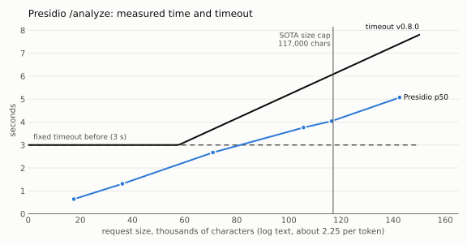
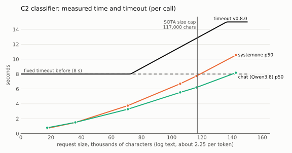
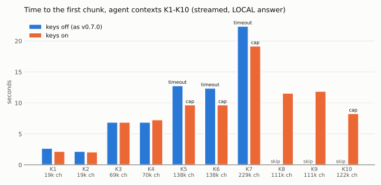

# SOTA size cap and timeouts that grow with the text: values and measurements, 2026-10-01

Router v0.8.0 adds two features for the large requests of the agents (see README "Large requests"):
a size cap for SOTA requests and detector timeouts that grow with the text. Both are off by default.
This page explains the values we chose for them, and shows the tests that support the values.

> **Update 2026-10-02:** the SOTA model is now gemini-2.5-pro and the cap is 150,000 characters. See
> [`sota-size-cap-2026-10-02.md`](sota-size-cap-2026-10-02.md).

> **Support status:** LiteLLM and Presidio are community software, not supported by Red Hat. The
> decision model (`systemone`) runs on an unsupported preview image.

## Values

| Key | Value | Why |
|---|---|---|
| `efficiency.sota_max_prompt_chars` (`chain.yaml`) | `117000` | The SOTA context window (65,536 tokens) minus the answer of the agents (`max_tokens` 8192, `components/triage-agent`) leaves 57,344 tokens for the request. Agent contexts have 2.24-2.30 characters per token (measured, see below). 117,000 characters are at most about 52,200 tokens: a margin of about 5,100 tokens (9%) |
| `ner.timeout_per_1k_chars` | `0.052` | Presidio took 5.07 s for 142,523 characters. 0.052 s per 1,000 characters gives 7.4 s there: a margin of about 1.5x |
| `ner.timeout_max_seconds` | `10` | Presidio runs 1 worker per pod. Above 10 s one request blocks it too long, and the perf script stops there too |
| `classifier.timeout_per_1k_chars` | `0.11` | `systemone` took 10.5 s for 142,523 characters. 0.11 gives 15.7 s there (capped at 15): a margin of about 1.4x |
| `classifier.timeout_max_seconds` | `15` | Upper bound of one C2 call. With the chat fallback the worst case of C2 is 2 x 15 s |
| `ner.timeout_seconds`, `classifier.timeout_seconds` | `3.0`, `8.0` (unchanged) | The base: short texts keep the timeout they had |

Other choices:

- **Characters, not tokens.** The router has no tokenizer, and a tokenizer in the image would have to
  work offline (the pod has no egress). The SOTA model counts with its own tokenizer anyway. Log text
  is the densest text we measured (about 2.25 characters per token); English prose has about 4, so a
  cap computed for log text is safe for every text, and keeps prose LOCAL earlier than needed.
- **The cap is in the efficiency gate.** It runs before the privacy gate, so above the cap no detector
  runs, and `decided_by` stays `efficiency` (no new value for the metric label or the dashboards).
- **Per call.** The timeouts bound one Presidio call (two when the language is uncertain) and one C2
  call (two with the chat fallback). With these values the worst case of the privacy gate is
  2 x 10 + 2 x 15 = 50 s. Under the cap, the measured worst case is about 4 s (Presidio) + 7.7 s
  (`systemone`), and C2 runs only in the gray zone.
- **The 65,536-token window** is the value given for the demo. It is not written in any repo: check it
  again when the SOTA model changes, and change the cap with it.

## Setup

- Cluster ocp.5bw8q, router v0.8.0, gitops `main` e1533c9. SOTA model: `openai/Qwen3.8-27B` on the
  RHDP LiteMaaS. Local model: Qwen3.8 on an RTX PRO 6000. C2: decision model (`systemone`,
  `samples: 1`, L40S) with the chat fallback on Qwen3.8. Presidio: 2 replicas, gunicorn 1 worker,
  4 threads.
- Text like the agents' tool output: Kubernetes log lines, events and ticket lines (the same generator
  as [`docs/c2-large-context-2026-10-01.md`](c2-large-context-2026-10-01.md)).
- **Phase 1**: router v0.8.0 with the new keys off (as merged). Validation groups `platform`,
  `isolation`, `access`, `routing`, `demo`, `context`.
- **Phase 2**: the same router with the keys on (values above), from the test branch
  `router-keys-on` of gitops. Only the Argo CD Application `litellm-router` pointed to the branch;
  the other applications stayed on `main`. Validation groups `routing`, `demo`, `context`. After the
  test the Applications went back to `main` and their specs were checked equal to the copies taken
  before.
- **Components**: [`perf/c2_perf.py --scenarios context`](../perf/c2_perf.py) from a LiteLLM pod,
  3 calls per size, one at a time.
- Raw data: [`perf/results/2026-10-01-ocp.5bw8q-v080-context.jsonl`](../perf/results/2026-10-01-ocp.5bw8q-v080-context.jsonl)
  (components) and [`perf/results/2026-10-01-ocp.5bw8q-v080-validation.json`](../perf/results/2026-10-01-ocp.5bw8q-v080-validation.json)
  (K1-K10, both phases). Charts: [`perf/plot_context_cap.py`](../perf/plot_context_cap.py).

## 1. Components: measured time and timeout





| Characters | Presidio p50 | Presidio timeout | `systemone` p50 | chat p50 | C2 timeout |
|---|---|---|---|---|---|
| 17,521 | 0.64 s | 3.0 s | 0.70 s | 0.78 s | 8.0 s |
| 36,137 | 1.31 s | 3.0 s | 1.49 s | 1.50 s | 8.0 s |
| 70,891 | 2.67 s | 3.7 s | 3.75 s | 3.27 s | 8.0 s |
| 105,647 | 3.76 s | 5.5 s | 6.70 s | 5.53 s | 11.6 s |
| 116,417 | 4.04 s | 6.1 s | 7.74 s | 6.20 s | 12.8 s |
| 142,523 (over the cap) | 5.07 s | 7.4 s | 10.54 s | 8.17 s | 15.0 s |

No error in 54 calls; Presidio stayed Ready with no restart. Both C2 backends found the sensitive
sentence at every size. The timeouts are the values of the formula with the keys on.

- The formula is above every measured point, with a margin of 1.4x to 1.7x.
- With the fixed timeouts, `systemone` is already at 7.7 s of 8 s just under the cap, and Presidio
  passes 3 s at about 80,000 characters. With the new timeouts no detector times out under the cap.

## 2. End to end: validation K1-K10

| Id | Context | Characters | Tokens | Phase 1 (keys off) | Phase 2 (keys on) |
|---|---|---|---|---|---|
| K1 | benign | 19,736 | 8,577 | LOCAL by privacy (rules), 2.7 s | the same, 2.2 s |
| K2 | sensitive | 19,943 | 8,672 | LOCAL by privacy (rules), 2.2 s | the same, 2.1 s |
| K3 | benign | 69,852 | 30,892 | LOCAL by privacy (rules), 6.9 s | the same, 6.9 s (Presidio timeout 3.6 s) |
| K4 | sensitive | 70,060 | 30,988 | LOCAL by privacy (rules), 6.9 s | the same, 7.3 s |
| K5 | benign | 138,518 | 61,615 | LOCAL, Presidio timeout (WARN), 12.8 s | LOCAL by the cap, 9.7 s |
| K6 | sensitive | 138,726 | 61,711 | LOCAL, Presidio timeout, 12.4 s | LOCAL by the cap, 9.7 s |
| K7 | benign | 229,153 | 101,796 | LOCAL, Presidio timeout (WARN), 22.4 s | LOCAL by the cap, 19.2 s |
| K8 | benign, under the cap | 111,147 | 49,567 | SKIP (cap off) | LOCAL by privacy (rules), 11.6 s, no timeout (Presidio 5.8 s, C2 12.2 s allowed) |
| K9 | sensitive, under the cap | 111,086 | 49,454 | SKIP | LOCAL by privacy (rules), 11.9 s |
| K10 | benign, over the cap | 122,741 | 54,567 | SKIP | LOCAL by the cap, 8.3 s, no detector |

The times are the time to the first chunk of the streamed answer. They include the prefill of the local
model, which grows with the context. Tokens: the usage of the local model (Qwen3.8 tokenizer, the same
model family as the SOTA model of this cluster).



Results: phase 1 53/60 (the only FAIL is P10, two applications of the triage demo not Healthy, not
related to the router; P4 and K5/K7 WARN as before v0.8.0); phase 2 **28/28 PASS**, no WARN.
Logs: `pr-texts/validate-2026-10-01-ocp.5bw8q-v080-phase1.log` and `-phase2.log` in the workspace.

## Findings

1. **No regression with the keys off.** Routing, demo and K1-K7 give the same decisions as v0.7.0.
2. **The cap removes the useless detector work.** Above the cap the request stays LOCAL at once: the
   first chunk comes about 3 s earlier (K5 12.8 s to 9.7 s, K7 22.4 s to 19.2 s), and Presidio gets
   no large text to block its worker.
3. **Under the cap no detector times out.** At 111,000 characters Presidio answers in time (5.8 s
   allowed). Before, the same request failed closed on a timeout.
4. **Safety holds.** Every sensitive context stayed LOCAL in both phases. No case reached SOTA.
5. **The cap matches the tokenizer.** 2.24-2.30 characters per token on agent contexts. K10
   (122,741 characters) has 54,567 tokens: it would still fit 57,344, so the cap is not too strict,
   and 117,000 characters keep about 5,100 tokens of margin.
6. **The main limit is still the NER on log text.** Every benign agent context under the cap stays
   LOCAL by the rules: Presidio reads pod names, ids and hostnames as PERSON, LOCATION, NRP and
   MEDICAL_LICENSE. The new keys make the gate faster and clearer; they do not let benign agent
   contexts reach SOTA. That needs NER tuning for log text (next step).

## Not measured

- Several agents at once: Presidio queues behind its worker (3 of 4 timed out at 30,000 tokens on
  2026-10-01). Longer timeouts do not fix that.
- Contexts in the gray zone of the rules: none of the K cases is there, so C2 never ran in K1-K10.
  The C2 timeouts are checked by the component test only.
- Real requests of the triage agent (the demo runs on this cluster since PR gitops #18, but its pod
  was not Ready during the test), Italian contexts, a SOTA model with another tokenizer.

## Reproduce

```bash
# Components, from a LiteLLM pod (copy perf/c2_perf.py and litellm/privacy_scoring.py to /tmp/perf)
python3 c2_perf.py --scenarios context --backends systemone-s1,chat \
  --decision-url http://dgemma-decision-predictor.local-models.svc.cluster.local/v1 \
  --chat-url http://qwen38-local-predictor.local-models.svc.cluster.local/v1 --chat-model qwen38-local \
  --presidio-url http://presidio-analyzer.maas-routing.svc.cluster.local:3000/analyze \
  --context-sizes 4000,8000,16000,24000,26000,32000

# End to end, from the validation repo
uv run ansible-playbook playbooks/validate.yml --tags routing,demo,context

# Charts
uv run --with matplotlib==3.10.7 perf/plot_context_cap.py
```
